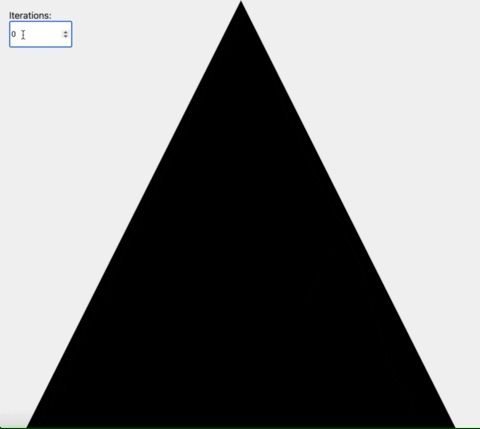

# `sierpinski-generator`

[Sierpiński triangle](https://en.wikipedia.org/wiki/Sierpi%C5%84ski_triangle) dataset generator.

## Install

```sh
yarn add sierpinski-generator
```

## Demo

See [demo](./demo/index.html) for interactive svg-generator.



## Usage

```ts
import { createSierpinskiTriangle } from 'sierpinski-generator';

const result = createSierpinskiTriangle({
  size: 1000,
  iterations: 4,
});

// [
//   {
//     box: { width: 1000, height: 1000, x: 0, y: 0 },
//     points: [
//       { x: 500, y: 0 },
//       { x: 0, y: 1000 },
//       { x: 1000, y: 1000 },
//     ],
//   },
//   {
//     box: { width: 500, height: 500, x: 250, y: 500 },
//     points: [
//       { x: 250, y: 500 },
//       { x: 750, y: 500 },
//       { x: 500, y: 1000 },
//     ],
//   },
//   {
//     box: { width: 250, height: 250, x: 375, y: 250 },
//     points: [
//       { x: 375, y: 250 },
//       { x: 625, y: 250 },
//       { x: 500, y: 500 },
//     ],
//   },
//   ...
// ];
```
