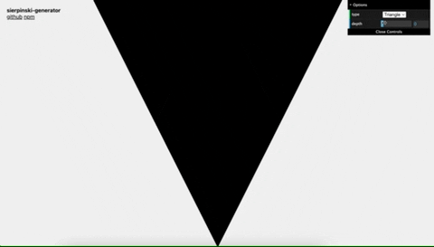

# `sierpinski-generator`

[Sierpiński triangle](https://en.wikipedia.org/wiki/Sierpi%C5%84ski_triangle) dataset generator.

See interactive svg-generator [demo](https://iam-medvedev.github.io/sierpinski-generator/).

## Install

```sh
yarn add sierpinski-generator
```

## Triangle generator



Usage:

```ts
import { createSierpinskiTriangle } from 'sierpinski-generator';

const result = createSierpinskiTriangle({
  size: 1000,
  iterations: 4,
});

// [
//   {
//     box: { width: 62.5, height: 62.5, x: 0, y: 0 },
//     points: [
//       { x: 0, y: 0 },
//       { x: 62.5, y: 0 },
//       { x: 31.25, y: 62.5 },
//     ],
//   },
//   {
//     box: { width: 62.5, height: 62.5, x: 62.5, y: 0 },
//     points: [
//       { x: 62.5, y: 0 },
//       { x: 125, y: 0 },
//       { x: 93.75, y: 62.5 },
//     ],
//   },
//   ...
// ];
```

## Carpet generator


Usage:

```ts
import { createSierpinskiCarpet } from 'sierpinski-generator';

const result = createSierpinskiCarpet({
  size: 1000,
  iterations: 4,
});

// [
//   { width: 333.3333333333333, height: 333.3333333333333, x: 0, y: 0 },
//   { width: 333.3333333333333, height: 333.3333333333333, x: 0, y: 333.3333333333333 },
// ];
```

## Local demo

```sh
yarn demo
```

## License

`sierpinski-generator` is [WTFPL licensed](./LICENSE).
